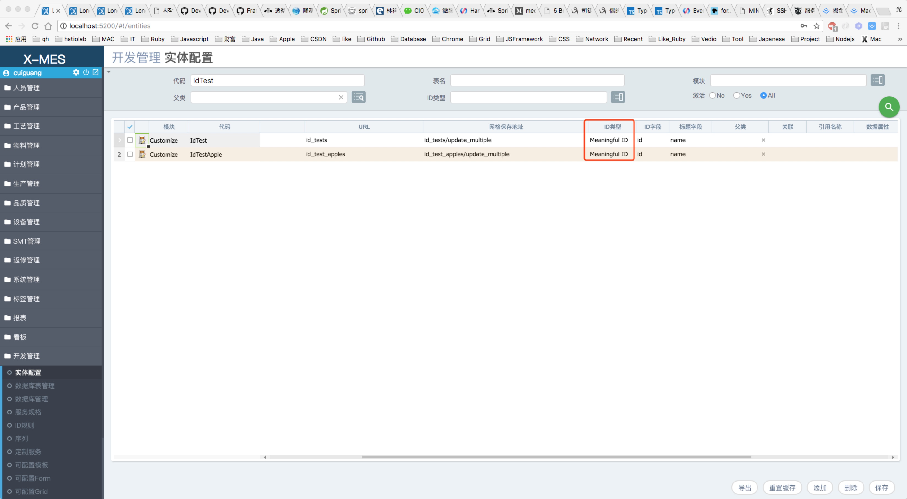
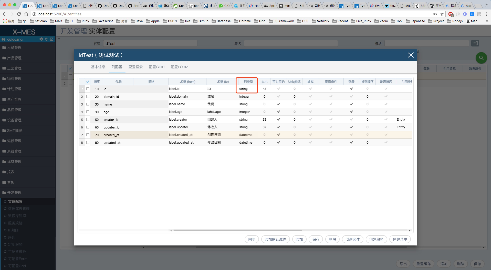
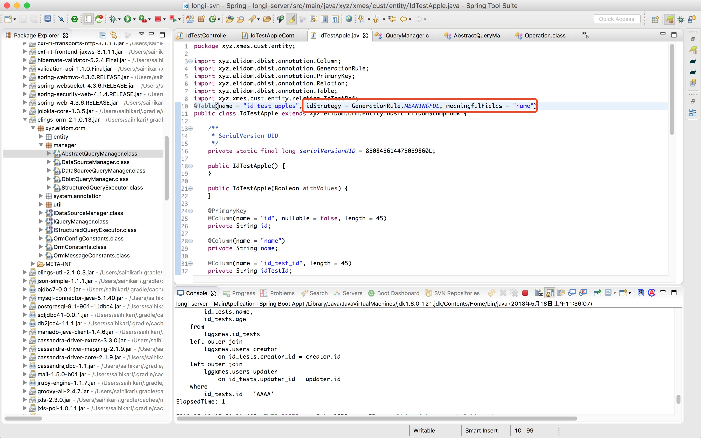
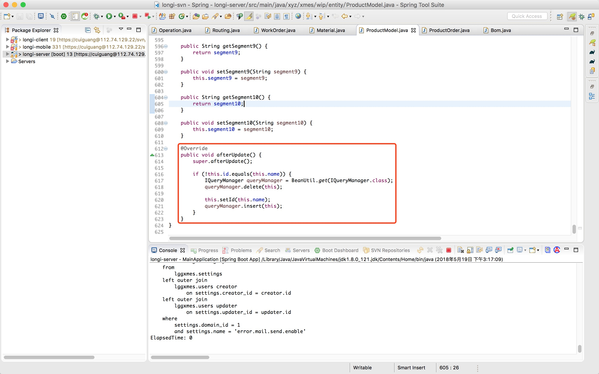
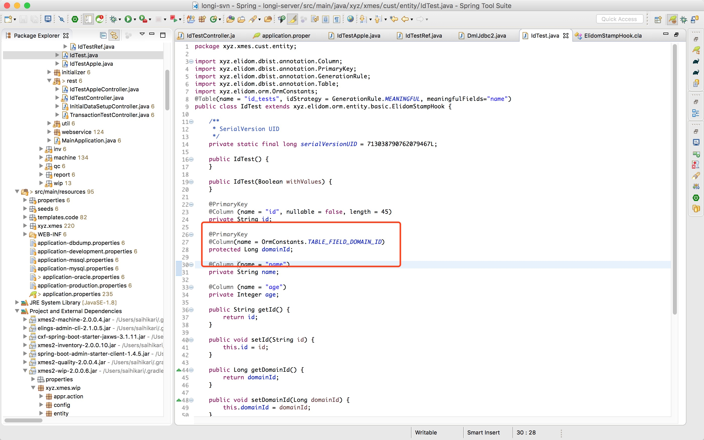
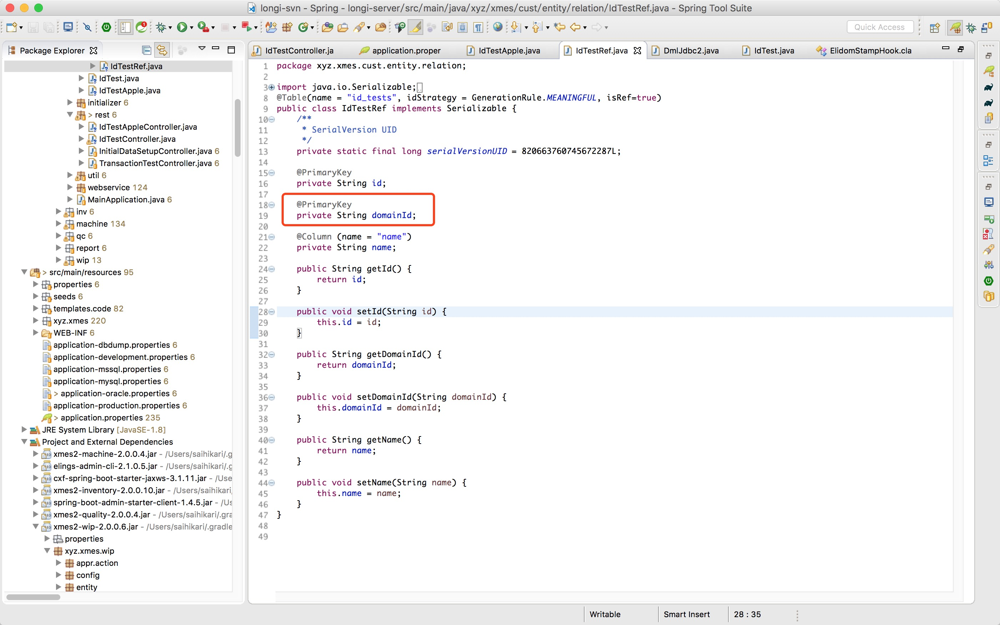
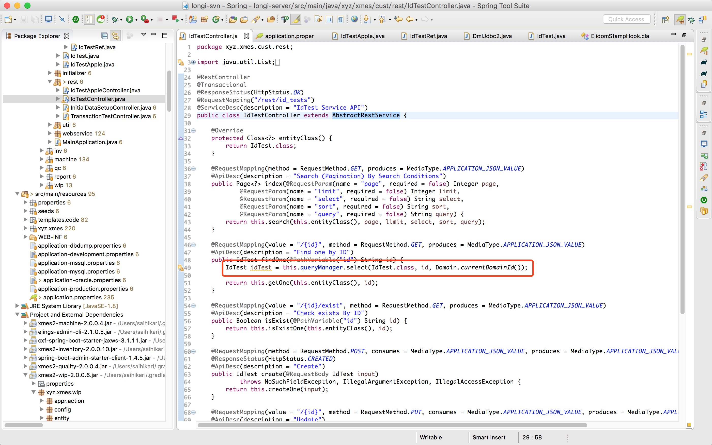

## 修改实体id=name方法 

### 修改实体配置里的实体信息
1. 修改ID类型
* ID类型修改为`Meaningful ID`

2. 确认ID字段类型
* 点击详细界面，检查并修改后的ID字段类型是否是`String`

### 修改实体类
1. 修改实体类注解
* 修改`idStrategy`的值改为`GenerationRule.MEANINGFUL`
* 添加`meaningfulFields`属性并赋值`name`

2. 添加或修改`afterUpdate`方法
* name变更时，id值也需要同步更新

---

## 修改域名作为主键的方法

### 修改实体类
1. 添加域名字段并添加注解
* 添加`@PrimaryKey`注解

### 修改实体ref类
1. 添加域名字段并添加注解
* 添加`@PrimaryKey`注解

### 修改服务类
1. 查询时需要带`domain_id`
* 如`select`函数，`id`和`domain_id`按顺序添加
